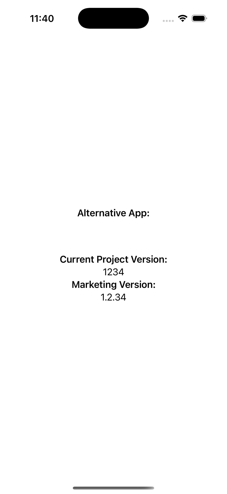

# CenterXCodeConfigs
XCode sample proyect that explains how to centralize config parameters used in many targets. This is the basecode for following post [Tired of Repeating Configs in Every Target?](https://javios.eu/uncategorized/tired-of-repeating-configs/)

## iOs App Review

## Requirements

- **Xcode 15.0 or later**
- **iOS 16.0 or later**
